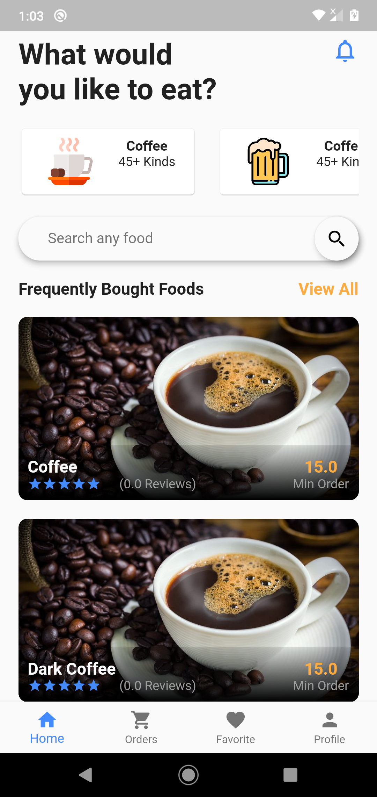
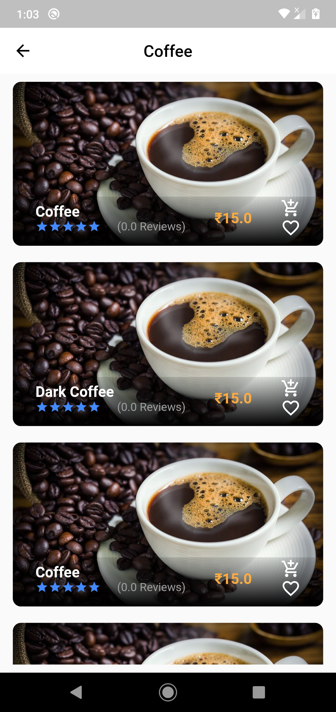
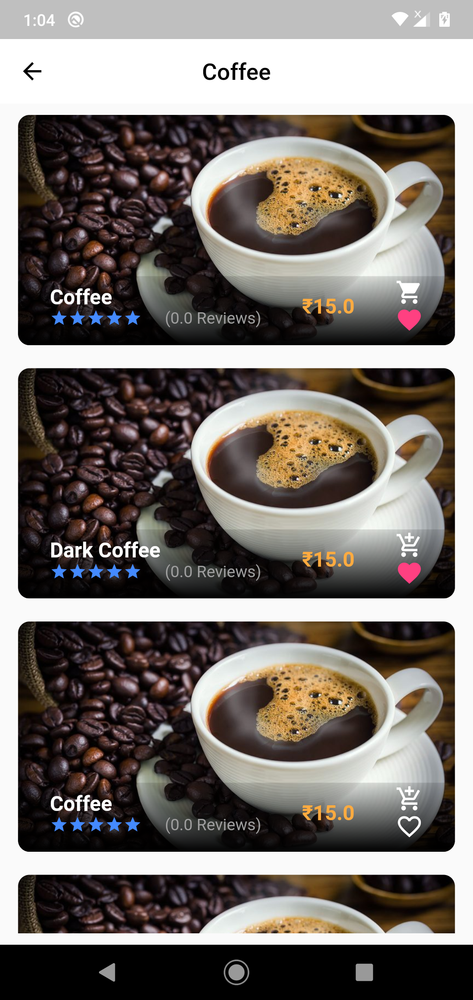
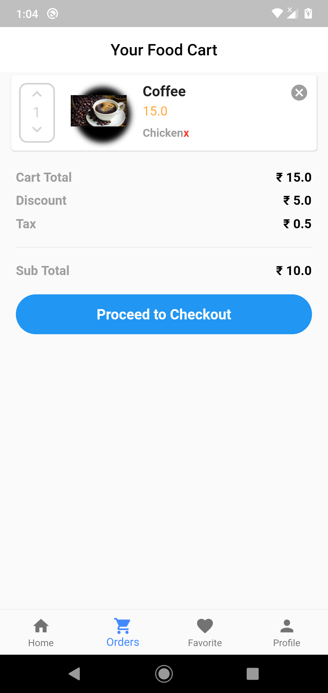
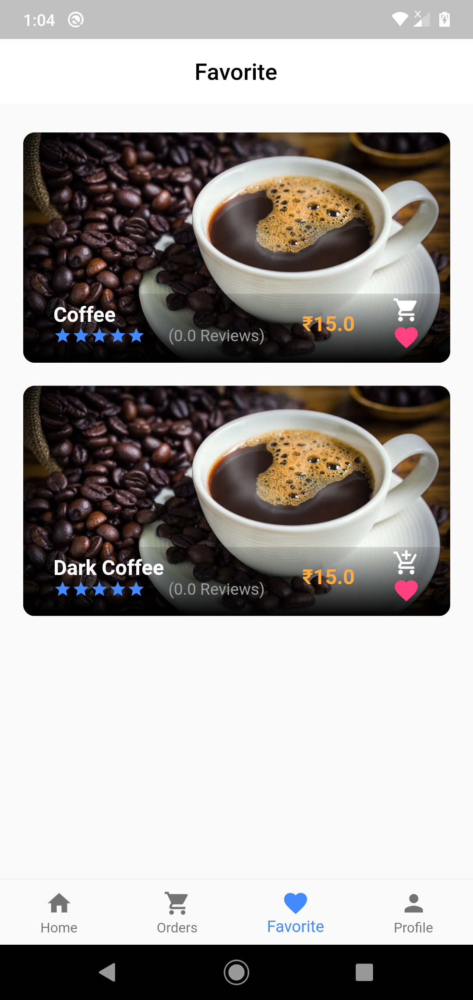
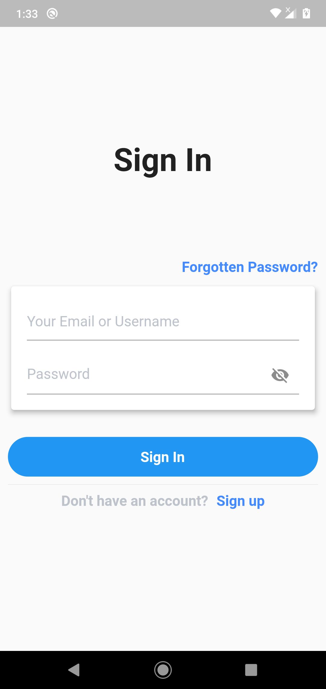
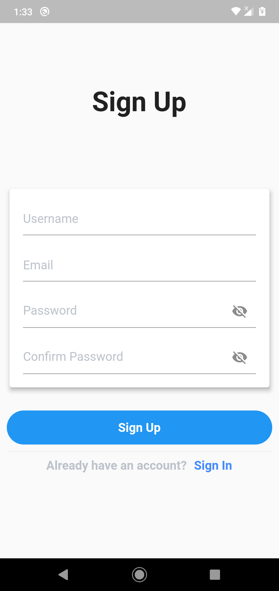

# Food App

This is a food ordering app.
## Features

* [x] Android and iOS

  * [x] Fetch Data from Firestore
  * [x] Beautiful UI
  * [x] Item Add To Cart
  * [x] Item Add To Favorite
  * [x] Order the food which is added in cart

### Screenshots

#### Home Screen

#### Prodects Screen

#### Prodect added to cart

#### Prodect added to favorite

#### Cart Screen

#### Favorite Screen

#### Login and Register Screen

 

### Created & Maintained By
[Shekhar Aggarwal](https://github.com/shekharAggarwal)

# License

    Copyright 2020 Shekhar Aggarwal

    Licensed under the Apache License, Version 2.0 (the "License");
    you may not use this file except in compliance with the License.
    You may obtain a copy of the License at

       http://www.apache.org/licenses/LICENSE-2.0

    Unless required by applicable law or agreed to in writing, software
    distributed under the License is distributed on an "AS IS" BASIS,
    WITHOUT WARRANTIES OR CONDITIONS OF ANY KIND, either express or implied.
    See the License for the specific language governing permissions and
    limitations under the License.

## Getting Started

For help getting started with Flutter, view our online
[documentation](http://flutter.io/).

For help on editing plugin code, view the [documentation](https://flutter.io/platform-plugins/#edit-code).
